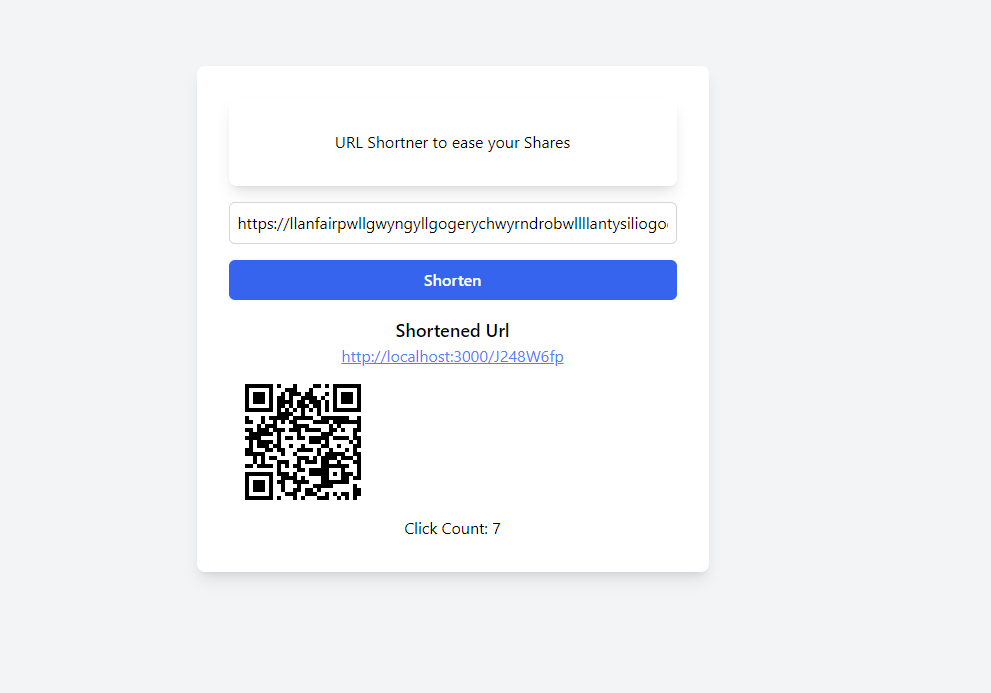

# URL Shortener Backend



This is the backend for a URL shortener application. It provides APIs for creating and managing shortened URLs.

## Table of Contents

- [Technologies Used](#technologies-used)
- [Getting Started](#getting-started)
  - [Prerequisites](#prerequisites)
  - [Installation](#installation)
- [Usage](#usage)
- [API Endpoints](#api-endpoints)
- [Frontend](#frontend)
- [Contributing](#contributing)
- [License](#license)

## Technologies Used

- Node.js
- Express.js
- MongoDB (with Mongoose)
- QR Code generation
- CORS for cross-origin resource sharing

## Getting Started

### Prerequisites

- Node.js (v14 or later recommended)
- MongoDB

### Installation

1. Clone the repository:

   ```
   git clone https://github.com/alavyap/URL_Shortner.git
   cd URL_Shortner/backend
   ```

2. Install dependencies:

   ```
   npm install
   ```

3. Create a `.env` file in the root directory and add your environment variables:

   ```
   MONGODB_URI=your_mongodb_connection_string
   PORT=3000
   ```

4. Start the development server:
   ```
   npm start
   ```

## Usage

The server will start running on `http://localhost:3000` (or the port you specified in the .env file).

## API Endpoints

- `POST /api/shorten`: Create a shortened URL
- `GET /:shortId`: Redirect to the original URL
- Additional endpoints for managing and retrieving URL data

(Note: Expand this section with more detailed API documentation)

## Frontend

This project includes a frontend built with React and Vite. To set up the frontend:

1. Navigate to the frontend directory:

   ```
   cd ../frontend
   ```

2. Install dependencies:

   ```
   npm install
   ```

3. Start the development server:
   ```
   npm run dev
   ```

The frontend will be available at `http://localhost:5173` by default.

## Contributing

Contributions are welcome! Please feel free to submit a Pull Request.


---
